 

## About

I build systems that **watch, reason and act on their own**: an AIOps engine that diagnoses and heals Kubernetes incidents, deepfake forensics, phishing detection, and the full-stack products around them.

- 🔭 **Now building:** [ASTRA](https://github.com/vishwab0815/ASTRA), LangGraph agents and local RAG that fix cluster incidents through human-approved GitOps PRs
- 🛡️ **Security:** CTF design, phishing and threat analysis, deepfake detection
- 🌱 **Learning:** Quantum ML · advanced AI agents · Kubernetes
- 🎓 **Engineering** at VTU, Bengaluru

> ⚙️ **This profile runs like production.** The cluster, status page and incident log below are rebuilt every hour from live data by [its own pipeline](.github/workflows/profile.yml). When a widget breaks, the README heals itself and logs the incident.

## Live cluster

  <picture>
    <source media="(prefers-color-scheme: dark)" srcset="https://raw.githubusercontent.com/vishwab0815/vishwab0815/output/cluster-dark.svg" />
    
  </picture>
   
  <b>Running</b>: pushed in the last 30 days · <b>Completed</b>: shipped and quiet · <b>CrashLoopBackOff</b>: failing CI checks

## Featured projects

<table>
  <tr>
    <td width="50%" valign="top">
      
      <h3><a href="https://github.com/vishwab0815/ASTRA">🌌 ASTRA</a></h3>
      
Autonomous AIOps engine for Kubernetes. It investigates alerts in real time, finds the root cause with multi-round telemetry reasoning and local vector memory, then ships the fix as a GitOps PR behind a human confidence gate.

      
      
      
      
    </td>
    <td width="50%" valign="top">
      
      <h3><a href="https://github.com/vishwab0815/FORENSICS">🕵️ Deepfake Forensics</a></h3>
      
Image, audio and video deepfake detection with visual evidence (Grad-CAM heatmaps, flagged spectrogram windows, per-frame confidence) and a timestamped PDF report ready for a cybercrime complaint.

      
      
      
      
    </td>
  </tr>
  <tr>
    <td width="50%" valign="top">
      
      <h3><a href="https://github.com/vishwab0815/Phish-Guard">🎣 PhishGuard</a></h3>
      
AI-assisted phishing and threat analysis for URLs, emails, files and messages. Layered checks (domain intel, SSL, IP reputation, threat feeds) roll up into one risk score, with an AI security chat for incident response.

      
      
      
      
    </td>
    <td width="50%" valign="top">
      
      <h3>📈 AlgoPilotX BTC</h3>
      
Real-time paper-trading engine for the BTCUSDT perpetual, written in Rust. It runs a Heikin-Ashi breakout strategy on live mark-price and order-book feeds, with trend and volatility filters, trailing stops and a crash-safe ledger.

      
      
      
      
    </td>
  </tr>
  <tr>
    <td width="50%" valign="top">
      
      <h3><a href="https://github.com/vishwab0815/CTF-CyberPunk">🛡️ CTF-CyberPunk</a></h3>
      
A narrative-driven cyberpunk CTF platform with animated terminals, interactive hacking levels and real-world web security challenges.

      
      
      
    </td>
    <td width="50%" valign="top">
      
      <h3><a href="https://github.com/vishwab0815/LLM-Trainer">🤖 BotTrainer</a></h3>
      
NLU platform that replaces model training with zero- and few-shot prompting on Llama-3-8B, plus Whisper for voice input. It does intent classification and entity extraction with Pydantic-validated output.

      
      
      
    </td>
  </tr>
</table>

**More builds:**
[TaskFlow](https://github.com/vishwab0815/TaskFlow) (real-time task manager, [live](https://task-flow-slots.vercel.app)) ·
[Quick-Bite](https://github.com/vishwab0815/Quick-Bite) (MERN food delivery, [live](https://quick-bite-bbgx.onrender.com)) ·
[ModEval](https://github.com/vishwab0815/ModEval) (sales forecasting, 84.6% avg accuracy across 43 states) ·
[Network-Simulator](https://github.com/vishwab0815/Network-Simulator) (automata-based protocol verification) ·
[Planet-Pulse](https://github.com/vishwab0815/Planet-Pulse) (climate change analysis)

## Tech stack

<table>
  <tr>
    <td><b>Frontend</b></td>
    <td></td>
  </tr>
  <tr>
    <td><b>Backend</b></td>
    <td></td>
  </tr>
  <tr>
    <td><b>AI / ML</b></td>
    <td>&nbsp;&nbsp;LangGraph · LangChain · Hugging Face · Llama 3 · Whisper · ChromaDB · Prophet · XGBoost</td>
  </tr>
  <tr>
    <td><b>DevOps / AIOps</b></td>
    <td>&nbsp;&nbsp;Helm · GitOps · Celery</td>
  </tr>
  <tr>
    <td><b>Data</b></td>
    <td></td>
  </tr>
</table>

## Status & incidents

  <picture>
    <source media="(prefers-color-scheme: dark)" srcset="https://raw.githubusercontent.com/vishwab0815/vishwab0815/output/status-dark.svg" />
    
  </picture>
    
  <picture>
    <source media="(prefers-color-scheme: dark)" srcset="https://raw.githubusercontent.com/vishwab0815/vishwab0815/output/incidents-dark.svg" />
    
  </picture>

## GitHub analytics

  <picture>
    <source media="(prefers-color-scheme: dark)" srcset="https://raw.githubusercontent.com/vishwab0815/vishwab0815/output/overview-dark.svg" />
    
  </picture>
  <picture>
    <source media="(prefers-color-scheme: dark)" srcset="https://raw.githubusercontent.com/vishwab0815/vishwab0815/output/languages-dark.svg" />
    
  </picture>
  <picture>
    <source media="(prefers-color-scheme: dark)" srcset="https://raw.githubusercontent.com/vishwab0815/vishwab0815/output/activity-dark.svg" />
    
  </picture>
    
  <picture>
    <source media="(prefers-color-scheme: dark)" srcset="https://raw.githubusercontent.com/vishwab0815/vishwab0815/output/github-contribution-grid-snake-dark.svg" />
    
  </picture>

  
  Everything above is rebuilt hourly from live data by <a href=".github/workflows/profile.yml">this repo's own workflow</a>. No third-party stats services.

